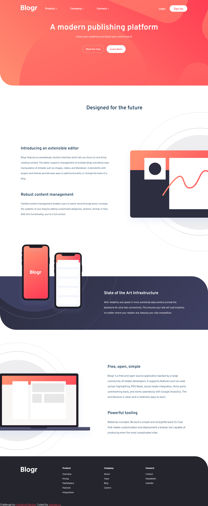

# Frontend Mentor - Calculator app solution

This is a solution to the [blogr landing page challenge on Frontend Mentor](https://www.frontendmentor.io/challenges/calculator-app-9lteq5N29). Frontend Mentor challenges help you improve your coding skills by building realistic projects. 

## Table of contents

- [Overview](#overview)
  - [The challenge](#the-challenge)
  - [Screenshot](#screenshot)
  - [Links](#links)

  - [Built with](#built-with)

- [Author](#author)

## Overview
This is a simple landing page layout built with html, scss and javascript, I took on this challenge to as a way of practicing what know about Sass so as such this is my first approach to using SASS to build a layout by my self and as expected there were a lot of things I could have done better,but for now I'm happy I was able to make something out of the challenge
### The challenge

Users should be able to:

- See the size of the elements adjust based on their device's screen size

### Screenshot

### Links

- Solution URL: [ solution URL here](https://www.frontendmentor.io/solutions/responsive-blogr-landing-page-teMkwKiNxe)
- Live Site URL: [live site URL here](https://joshuaaj003.github.io/blogr-frontendmentor-challenge/)

### Built with

- Semantic HTML5 markup
- CSS custom properties
- Flexbox
- CSS Grid
- Javascript
- SASS
- Mobile-first workflow

## Author

- Frontend Mentor - [@joshuaAj003](https://www.frontendmentor.io/profile/joshuaAj003)
- Twitter - [@JAjorgbor](https://www.twitter.com/JAjorgbor)

